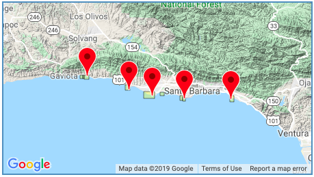

```{r setup, include=FALSE}
knitr::opts_chunk$set(echo = FALSE,
                      warning = FALSE,
                      message = FALSE)
```


### Introduction 


 *California Kelp Forest. Source: https://sbclter.msi.ucsb.edu*
 
The Spiny Lobster fishery has great ecological and socioeconomic importance in the Santa Barbara community. Implementation of marine reserves has served as a method to enhance the health of marine environments and particular fisheries, while also benefiting fishers through spillover effects. Evaluation of marine reserves however has previously been limited by a lack of long term and replicable monitoring efforts (Kay et al., 2012). The [Santa Barbara Coastal Long-Term Ecological Research](https://sbclter.msi.ucsb.edu) (SBC LTER) program was established in 2000 to address this need for a more in-depth understanding of how marine reserves impact kelp forest communities. Spiny lobsters are considered to have heavy influences on the overall health of kelp forests, as they are a predator of sea urchins which graze on kelp (Foster et al., 2010). By maintaining healthy lobster populations, urchin populations will be appropriately checked to avoid overgrazing of kelp. This report will explore spiny lobster populations at five sites along the Santa Barbara coast, and evaluate population differences over time, across sites, and as it relates to protection status. 


*Map of survey sites. Source:Reed D. (SBC LTER)*

### Data and Methods 

The data utilized in this report was collected as a part of the Santa Barbara Coastal Long-Term Ecological Research Program. Sampling began in 2012 and is ongoing, with surveys conducted by divers in late summer before the start of the fishing season (Reed 2019). Sizes were determined by visual estimate of carapace length (mm) and abundance by count of individuals of each size. The analysis in this report explored three primary areas of interest: annual lobster abundance by site, size distribution of lobsters, and lobster size and abundance inside and outside of marine reserves. Average lobster size within and outside of marine reserves was compared for 2012 and 2018 by two sample t-tests (α = 0.05 throughout).All data analsis and figures were created using R software version 3.6.1. 

### Results 


```{r}
#Load packages

library(tidyverse)
library(janitor)
library(here)
library(tidyr)
library(ggridges)
library(lattice)
library(knitr)
library(kableExtra)
```


```{r}
#Load in data 

lobster_abundance <- read_csv(("lobster_abundance_sbc_lter.csv"),
                               na = "-99999") %>% 
  janitor::clean_names() %>% 
  tidyr::uncount(count)


```

#### 1. Changes in annual lobster abundance by site  


```{r}
#Data w MPA status column 

lobster_annual <- lobster_abundance %>% 
  group_by(site) %>% 
  #count(year) %>% 
  mutate(mpa = case_when(
    site %in% c("NAPL","IVEE") ~ "Protected", 
    site %in% c("AQUE","CARP","MOHK") ~ "Unprotected") 
  )

lobster_yr_count <- lobster_annual %>% 
  count(year)

lobster_annual$site <- gsub("IVEE", "Isla Vista", lobster_annual$site)

lobster_annual$site <- gsub("NAPL", "Naples", lobster_annual$site)

lobster_annual$site <- gsub("AQUE", "Arroyo Quemando", lobster_annual$site)

lobster_annual$site <- gsub("CARP", "Carpinteria", lobster_annual$site)

lobster_annual$site <- gsub("MOHK", "Mohawk", lobster_annual$site)
```


```{r}
#graph of lobster abundance by site over time

annual_graph <- ggplot(lobster_annual, aes(x = year)) +
  geom_histogram(binwidth = 1, 
                 #show.legend = FALSE, 
                 aes(fill = mpa)) +
  facet_wrap(~site) +
  #scale_x_continuous(expand = c(0,0)) +
  labs(x = "Year",
       y = "Annual Lobster Abundance",
       title = "Annual Lobster Abundance Across Five Sites") +
  scale_fill_manual(values = c("deepskyblue", "deepskyblue4"))+
  theme_minimal()

#annual_graph

ggsave("annual_abundance_graph.png", plot = annual_graph, path = here::here("figures"))
```

Trends in lobster abundance across sites was compared from 2012-2018, while noting differences between protected and unprotected sites (Figure 1). Both Carpinteria and Isla Vista display increases in lobster abundance in 2017 and 2018 when compared to previous years, with Carpinteria having a maximum abundance of over 700 lobsters and Isla Vista having a maximum abundance of over 900. Arroyo Quemando was notably low in abundance when compared to other sites, with abundance fluctuating below 150. 


`)


#### 2. Size distribution  comparison of lobsters in 2012 and 2018


```{r}
#size distribution data 
lobster_size_dist <- lobster_annual %>% 
  select(date, year, site, size_mm, mpa) %>% 
  filter(year %in% c(2012, 2018)) %>% 
  group_by(site, year) %>% 
  mutate(avg_size_mm = mean(size_mm))

avg_lobster_sizes <- lobster_annual %>% 
  select(date, year, site, size_mm, mpa) %>% 
  filter(year %in% c(2012, 2018)) %>% 
  group_by(site, year) %>% 
  summarize(avg_size_mm = mean(size_mm))


#graph size distribution 

size_dist_graph <- ggplot(lobster_size_dist, aes(x = size_mm, y = site)) +
  geom_density_ridges(aes(fill = mpa)) +
  facet_wrap(~year, scales = "free") +
  theme_minimal() +
  scale_x_continuous(limits = c(25, 175), 
                     expand = c(0,0)) +
  scale_fill_manual(values = c("deepskyblue", "deepskyblue4"))+
  labs(title = "Size Distribution of Lobsters Across Sites in 2012 and 2018", 
       y = "Site Name", 
       x = "Size (mm)")

#size_dist_graph

ggsave("size_dist_graph.png", plot = size_dist_graph, path = here::here("figures"))
```


Size distributions of lobsters across sites in 2012 and 2018 are illustrated in Figure 2. Size distributions appear to become in general more unimodal in 2018 when compared to 2012, but all appear generally normally distributed. When looking at specific sites, changes in size from 2012 to 2018 can be more easily identified. Mean lobster sizes at Arroyo Quemando(~71mm) and Carpinteria(~74mm) did not change substantially over time. At Isla Vista and Naples however, mean lobster sizes increased from 66mm to 76mm and 73mm to 80mm respectively. Mohawk reef is the only site at which mean lobster sizes decreased, going from 77mm to 72mm. 


`)


#### 3. Comparison of average lobster size (mm) between sites that are within marine reserves and sites that are not within marine reserves in 2012 and 2018


```{r}
lobster_mpa <- lobster_abundance %>% 
  filter(year %in% c("2012","2018")) %>% 
  mutate(mpa_status = case_when(
    site %in% c("NAPL","IVEE") ~ "Protected", 
    site %in% c("AQUE","CARP","MOHK") ~ "Unprotected")) %>% 
  select(year, site, size_mm, mpa_status)
  
```


```{r}
#Summary data to find mean sizes for different groups 

lob_summary <- lobster_mpa %>% 
  group_by(year, mpa_status) %>% 
  summarise(avg_size_mm = mean(size_mm, na.rm = TRUE), 
            st_dev = sd(size_mm, na.rm = TRUE), 
            sample_size = n(), 
            #median_size = median(size_mm, na.rm = TRUE), 
            size_min = min(size_mm, na.rm = TRUE), 
            size_max = max(size_mm, na.rm = TRUE)
            ) 


```


```{r}
#Sorting data into four separate data frames for stats analysis

lob_2012_mpa <- lobster_mpa %>% 
  filter(mpa_status %in% "Protected") %>% 
  filter(year %in% "2012")

lob_2018_mpa <- lobster_mpa %>% 
  filter(mpa_status %in% "Protected") %>% 
  filter(year %in% "2018")

lob_2012_unprotected <- lobster_mpa %>% 
  filter(mpa_status %in% "Unprotected") %>% 
  filter(year %in% "2012")

lob_2018_unprotected <- lobster_mpa %>% 
  filter(mpa_status %in% "Unprotected") %>% 
  filter(year %in% "2018")


```


```{r}
#T Tests 
#Is there a difference in the mean size of lobsters in 2012 at mpa sites v non mpa sites?

size_v_protection_2012 <- t.test(lob_2012_mpa$size_mm, lob_2012_unprotected$size_mm)

#size_v_protection_2012
```


```{r}
#Is there a difference in the mean size of lobsters in 2018 at mpa sites v non mpa sites?


size_v_protection_2018 <- t.test(lob_2018_mpa$size_mm, lob_2018_unprotected$size_mm)

#size_v_protection_2018
```


```{r}
#Is there a difference in the mean size of lobsters at mpa sites in 2012 v 2018?

size_v_year_mpa <- t.test(lob_2018_mpa$size_mm, lob_2012_mpa$size_mm)

#size_v_year_mpa
```


```{r}
#Is there a difference in the mean size of lobsters at unprotected sites in 2012 v 2018? 

size_v_year_unprotected <- t.test(lob_2018_unprotected$size_mm, lob_2012_unprotected$size_mm)

#size_v_year_unprotected
```

To explore the influence of mpa status on lobster size specifically, data for all sites was combined on basis of mpa status and two sample t-tests were performed. In 2012 the average size of lobsters within protected areas (`r round(size_v_protection_2012$estimate[1],2)`mm) and the average size of lobsters in unprotected areas (`r round(size_v_protection_2012$estimate[2],2)`mm), was determined to be significantly different (t(`r round(size_v_protection_2012$parameter,2)`), *p* =(`r round(size_v_protection_2012$p.value,2)`)). This indicates that lobster sizes at protected and unprotected sites were likely already distinct from one another before the influence of protection from fishing pressure. In 2018, the average size of lobsters within protected areas (`r round(size_v_protection_2018$estimate[1],2)`mm) was still determined to be significantly different than those in unprotected areas (`r round(size_v_protection_2018$estimate[2],2)`mm) (t(`r round(size_v_protection_2018$parameter,2)`), *p* =(`r round(size_v_protection_2018$p.value,2)`)). 

The average size of lobsters within protected areas increased from `r round(size_v_protection_2012$estimate[1],2)`mm in 2012 to `r round(size_v_protection_2018$estimate[1],2)`mm in 2018 and this increase was determined to be statistically significant (t(`r round(size_v_year_mpa$parameter,2)`), *p* =(`r round(size_v_year_mpa$p.value,2)`)).
The average size of lobsters in unprotected areas (`r round(size_v_protection_2018$estimate[2],2)`mm) decreased from 2012 to 2018, however this decrease was not determined to be statistically significant (t(`r round(size_v_year_unprotected$parameter,2)`), *p* =(`r round(size_v_year_unprotected$p.value,2)`)).


**Table 1.** *Average lobster size, standard deviation, sample size and minnimum and maximum sizes are shown in the summary table for protected and unprotected sites in 2012 and 2018.*

```{r}
#make a summary table with important info

lob_sum_table <- lob_summary %>% 
  kable(col.names = c("Year",
                      "MPA Status", 
                      "Average Lobster Size(mm)", 
                      "Standard Deviation", 
                      "Sample Size",
                      "Minnimum Size (mm)", 
                      "Maximum Size (mm)")) %>%
  add_header_above(c("Spiny Lobster Sizes in Santa Barbara" = 7)) %>% 
  kable_styling(bootstrap_options = c("hover",
                                      "condensed", 
                                      "responsive"), 
                fixed_thead = T)

lob_sum_table
```

### Summary 

- Out of the five sites that were surveyed, the ones that became protected from fishing pressure in 2012 were already characteristically different than those sites that did not gain protective status (Table 1.) Over six years, protection from fishing pressure is associated with an increase in average lobster size that was determined to be statistically significant. 

- Protection from fishing pressure did not have a clear influence on lobster abundance across all sites, but in Isla Vista lobster abundance increased drastically from 2012 to 2018 (Figure 1). This change merits further investigation to gain understanding of what led to the increase in abundance.

- Protection from fishing pressure appears to be correlated with a positive increase in mean lobster size. Size distributions of lobster populations in sites that are located outside of marine protected areas do not appear to have changed notably from 2012-2018 (Table 1). This may indicate that while protective status may cause lobster populations to increase in mean size, lobster populations at sites where the protective status remained unchanged are relatively stable. 


### References 


Foster, M.S., Schiel, D.R. 2010. Loss of predators and the collapse of southern California kelp forests (?): Alternatives, explanations and generalizations. *Journal of Experimental Marine Biology and Ecology.*393:59-70. http://dx.doi:10.1016/j.jembe.2010.07.002. 

Guenther, C., Lopez-Carr, D., Lenihan, H.S. 2015. Differences in lobster fishing effort before and after MPA establishment. *Applied Geography.* 59:78-87. http://dx.doi.org/10.1016/j.apgeog.2014.12.0160143-6228. 

Kay, M.C., Lenihan, H.S., Guenther, C.M., Wilson, J.R., Miller, C.J., Shrout, S.W. 2012. Collaborative assessment of California spiny lobster population and fishery responses to a marine reserve network. *Ecological Applications.* 22:1. http://dx.doi.org/10.6084/m9.figshare.c.3295304. 

Reed D. 2019. SBC LTER: Reef: Abundance, size and fishing effort for California Spiny Lobster (Panulirus interruptus), ongoing since 2012. Environmental Data Initiative. https://doi.org/10.6073/pasta/a593a675d644fdefb736750b291579a0. Dataset accessed 11/18/2019.
